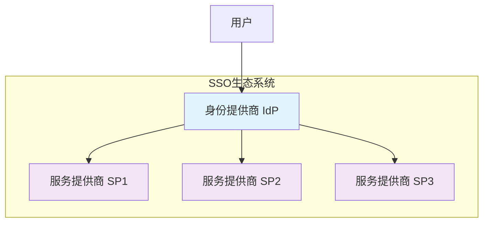
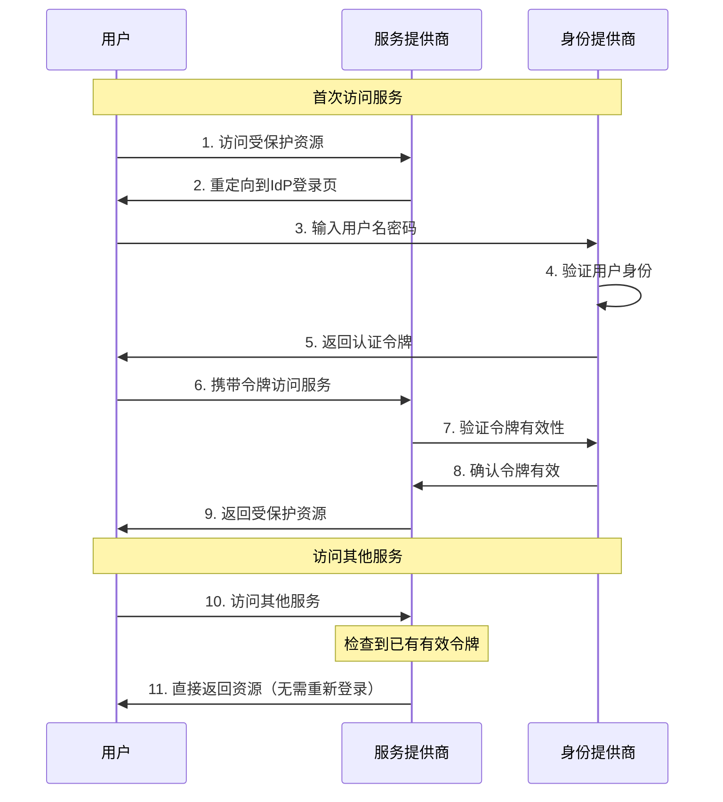
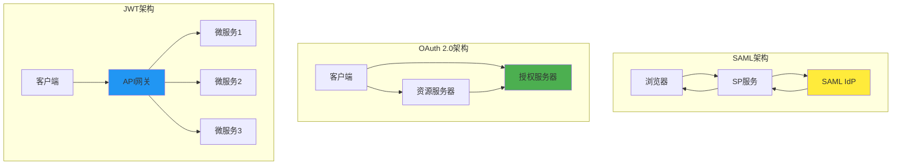
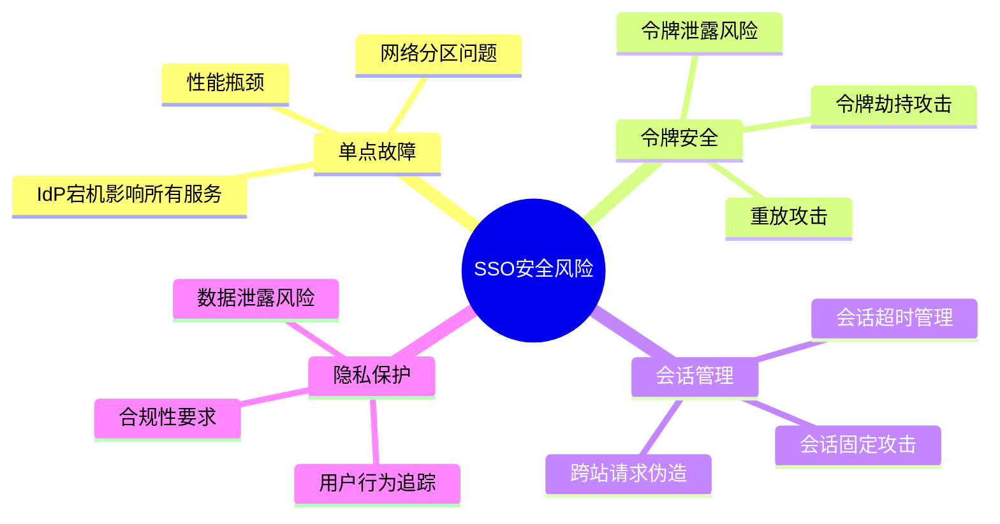
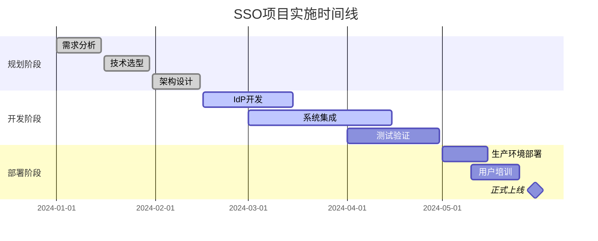

## 什么是SSO？

SSO（Single Sign-On）单点登录，简单来说就是**一次登录，处处通行**。

想象一下，你在公司里需要使用邮箱、OA系统、财务系统、项目管理工具等多个系统。如果没有SSO，你需要记住每个系统的账号密码，每次切换系统都要重新登录。有了SSO，你只需要登录一次，就能访问所有授权的系统。

## 生活中的SSO例子

### 🏢 办公场景

- **微信生态**：登录微信后，可以直接使用小程序、公众号、微信支付等
- **Google账户**：登录Gmail后，可以直接使用YouTube、Google Drive、Google Docs等
- **阿里巴巴**：登录淘宝后，可以直接使用支付宝、天猫、钉钉等

### 🎮 娱乐场景

- **Steam平台**：登录Steam后，可以玩所有已购买的游戏
- **Netflix**：一个账户可以在手机、电脑、电视等多个设备使用

## SSO的核心优势

### 👤 用户体验

- ✅ **减少密码疲劳**：不用记住多个密码
- ✅ **提升效率**：无需重复登录
- ✅ **降低遗忘风险**：只需记住一个主密码

### 🔒 安全性

- ✅ **统一安全策略**：集中管理用户权限
- ✅ **减少密码泄露**：密码数量减少，风险降低
- ✅ **审计追踪**：统一的登录日志便于监控

### 💰 成本效益

- ✅ **降低运维成本**：统一的用户管理
- ✅ **减少技术支持**：用户忘记密码的求助减少
- ✅ **提高开发效率**：新系统接入更简单

## SSO实现原理

### 核心组件



- **IdP（Identity Provider）**：身份提供商，负责用户认证
- **SP（Service Provider）**：服务提供商，提供具体业务服务
- **用户**：需要访问多个服务的最终用户

## SSO登录流程详解

### 完整登录流程



### 流程说明

1. **首次访问**：用户访问需要登录的服务
2. **重定向认证**：服务发现用户未登录，重定向到统一登录页
3. **身份验证**：用户在IdP输入凭据进行身份验证
4. **令牌颁发**：验证成功后，IdP颁发认证令牌
5. **服务访问**：用户携带令牌访问原始服务
6. **令牌验证**：服务验证令牌的有效性
7. **资源返回**：验证通过，返回请求的资源
8. **后续访问**：访问其他服务时，直接使用已有令牌，无需重新登录

## 主流SSO实现方案

### 1. SAML（Security Assertion Markup Language）

**特点**：

- 基于XML的标准协议
- 企业级应用广泛使用
- 安全性高，功能完整

**适用场景**：

- 大型企业内部系统集成
- 跨组织的联邦身份认证

**实现示例**：

```xml
<!-- SAML断言示例 -->
<saml:Assertion>
  <saml:Subject>
    <saml:NameID>user@company.com</saml:NameID>
  </saml:Subject>
  <saml:AttributeStatement>
    <saml:Attribute Name="Department">
      <saml:AttributeValue>Engineering</saml:AttributeValue>
    </saml:Attribute>
  </saml:AttributeStatement>
</saml:Assertion>
```

### 2. OAuth 2.0 + OpenID Connect

**特点**：

- 现代化的授权框架
- 支持移动端和Web应用
- JSON格式，易于解析

**适用场景**：

- 互联网应用
- 移动应用
- 第三方应用集成

**实现示例**：

```javascript
// OAuth 2.0 授权码流程
const authUrl = `https://auth.example.com/oauth/authorize?
  client_id=your_client_id&
  response_type=code&
  redirect_uri=https://yourapp.com/callback&
  scope=openid profile email`;

// 用户授权后获取访问令牌
const tokenResponse = await fetch('https://auth.example.com/oauth/token', {
  method: 'POST',
  headers: { 'Content-Type': 'application/x-www-form-urlencoded' },
  body: new URLSearchParams({
    grant_type: 'authorization_code',
    code: authorizationCode,
    client_id: 'your_client_id',
    client_secret: 'your_client_secret'
  })
});
```

### 3. CAS（Central Authentication Service）

**特点**：

- 简单易用的SSO解决方案
- 基于票据（Ticket）的认证机制
- 开源且成熟稳定

**适用场景**：

- 教育机构
- 中小型企业
- 需要快速部署SSO的场景

### 4. JWT（JSON Web Token）

**特点**：

- 无状态的令牌格式
- 自包含用户信息
- 跨域友好

**实现示例**：

```javascript
// JWT令牌结构
const jwt = {
  header: {
    alg: 'HS256',
    typ: 'JWT'
  },
  payload: {
    sub: 'user123',
    name: '张三',
    email: 'zhangsan@company.com',
    exp: 1640995200
  },
  signature: '签名信息'
};

// 验证JWT令牌
const verifyToken = (token) => {
  try {
    const decoded = jwt.verify(token, secretKey);
    return { valid: true, user: decoded };
  } catch (error) {
    return { valid: false, error: error.message };
  }
};
```

## 技术架构对比



## 实际应用案例

### 案例1：企业内部系统集成

**场景**：某公司有OA、CRM、ERP、邮箱等10个系统

**解决方案**：

1. 部署统一身份认证中心（基于SAML）
2. 各系统接入SSO协议
3. 员工只需登录一次，即可访问所有系统

**效果**：

- 登录时间从平均5分钟减少到30秒
- 密码重置请求减少80%
- 系统间切换效率提升300%

### 案例2：电商平台生态

**场景**：电商平台包含主站、商家后台、物流系统、支付系统

**解决方案**：

1. 使用OAuth 2.0 + OpenID Connect
2. 统一用户中心管理所有用户信息
3. 各子系统通过API获取用户信息

**技术实现**：

```javascript
// 用户中心API
class UserService {
  /**
   * 验证用户令牌并获取用户信息
   * @param {string} token - 访问令牌
   * @returns {Object} 用户信息
   */
  async getUserInfo(token) {
    const decoded = this.verifyToken(token);
    if (!decoded.valid) {
      throw new Error('Invalid token');
    }

    return {
      userId: decoded.sub,
      username: decoded.name,
      email: decoded.email,
      roles: decoded.roles,
      permissions: decoded.permissions
    };
  }

  /**
   * 检查用户权限
   * @param {string} userId - 用户ID
   * @param {string} resource - 资源名称
   * @returns {boolean} 是否有权限
   */
  async checkPermission(userId, resource) {
    const user = await this.getUser(userId);
    return user.permissions.includes(resource);
  }
}
```

## SSO安全考虑

### 安全风险



### 安全最佳实践

1. **令牌安全**

   ```javascript
   // 令牌加密存储
   const encryptToken = (token) => {
     return CryptoJS.AES.encrypt(token, secretKey).toString();
   };

   // 设置合理的过期时间
   const tokenConfig = {
     accessTokenExpiry: '15m', // 访问令牌15分钟
     refreshTokenExpiry: '7d', // 刷新令牌7天
     sessionTimeout: '8h' // 会话超时8小时
   };
   ```

2. **传输安全**
   - 强制使用HTTPS
   - 实施证书绑定
   - 启用HSTS头

3. **访问控制**

   ```javascript
   /**
    * 基于角色的访问控制
    * @param {Object} user - 用户信息
    * @param {string} resource - 资源路径
    * @returns {boolean} 访问权限
    */
   const checkAccess = (user, resource) => {
     const rolePermissions = {
       admin: ['*'],
       manager: ['/dashboard', '/reports', '/team'],
       employee: ['/dashboard', '/profile']
     };

     const userPermissions = rolePermissions[user.role] || [];
     return (
       userPermissions.includes('*') ||
       userPermissions.some((perm) => resource.startsWith(perm))
     );
   };
   ```

## 部署实施指南

### 实施步骤



### 技术选型建议

| 场景         | 推荐方案         | 理由               |
| ------------ | ---------------- | ------------------ |
| 企业内部系统 | SAML 2.0         | 成熟稳定，安全性高 |
| 互联网应用   | OAuth 2.0 + OIDC | 现代化，移动友好   |
| 微服务架构   | JWT              | 无状态，性能好     |
| 快速原型     | CAS              | 简单易用，快速部署 |

## 常见问题解答

### Q1: SSO会影响系统性能吗？

**A**: 合理设计的SSO系统不会显著影响性能。通过以下方式优化：

- 使用缓存减少IdP查询
- 令牌本地验证（如JWT）
- 负载均衡和高可用部署

### Q2: 如何处理SSO的单点故障？

**A**: 多种策略确保高可用：

```javascript
// 故障转移机制
const authStrategies = [
  { type: 'primary', url: 'https://auth1.company.com' },
  { type: 'backup', url: 'https://auth2.company.com' },
  { type: 'local', url: 'https://local-auth.company.com' }
];

/**
 * 智能认证路由
 * @param {Object} request - 认证请求
 * @returns {Promise} 认证结果
 */
const authenticate = async (request) => {
  for (const strategy of authStrategies) {
    try {
      return await callAuthService(strategy.url, request);
    } catch (error) {
      console.warn(`Auth strategy ${strategy.type} failed:`, error.message);
      continue;
    }
  }
  throw new Error('All authentication strategies failed');
};
```

### Q3: 如何在现有系统中逐步实施SSO？

**A**: 采用渐进式迁移策略：

1. **第一阶段**：部署SSO基础设施
2. **第二阶段**：新系统直接接入SSO
3. **第三阶段**：核心系统逐步迁移
4. **第四阶段**：遗留系统通过代理接入

## 总结

SSO单点登录是现代企业数字化转型的重要基础设施。通过统一的身份认证，不仅能提升用户体验，还能加强安全管理，降低运维成本。

**选择SSO方案时的关键考虑因素**：

- 🎯 **业务需求**：内部系统 vs 外部集成
- 🔧 **技术栈**：现有技术架构的兼容性
- 🛡️ **安全要求**：合规性和安全等级
- 📈 **扩展性**：未来业务发展的需要
- 💰 **成本预算**：开发、部署和维护成本

记住，SSO不是银弹，需要结合具体业务场景选择合适的实现方案。从小规模试点开始，逐步扩展到全企业范围，才是明智的实施策略。
