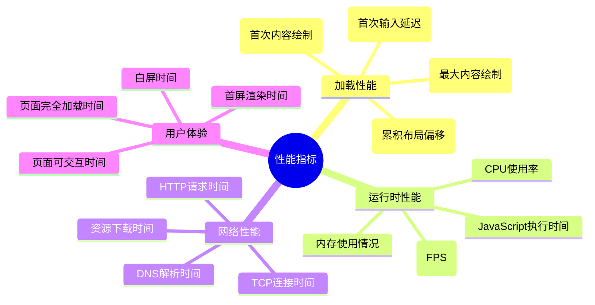

性能优化是前端开发中的重要环节，直接影响用户体验和业务指标。本文将从构建优化、HTTP缓存、代码分割等多个维度，详细介绍前端性能优化的实战策略。

## 性能优化分析框架

### 性能指标体系



### 性能分析工具

```javascript
/**
 * 性能监控工具类
 * 用于收集和分析页面性能数据
 */
class PerformanceMonitor {
  constructor() {
    this.metrics = {};
    this.observers = [];
  }

  /**
   * 初始化性能监控
   */
  init() {
    this.observeWebVitals();
    this.observeResourceTiming();
    this.observeNavigationTiming();
  }

  /**
   * 监控Web Vitals指标
   */
  observeWebVitals() {
    // 监控LCP (Largest Contentful Paint)
    new PerformanceObserver((entryList) => {
      const entries = entryList.getEntries();
      const lastEntry = entries[entries.length - 1];
      this.metrics.lcp = lastEntry.startTime;
      console.log('LCP:', lastEntry.startTime);
    }).observe({ entryTypes: ['largest-contentful-paint'] });

    // 监控FID (First Input Delay)
    new PerformanceObserver((entryList) => {
      const entries = entryList.getEntries();
      entries.forEach((entry) => {
        this.metrics.fid = entry.processingStart - entry.startTime;
        console.log('FID:', entry.processingStart - entry.startTime);
      });
    }).observe({ entryTypes: ['first-input'] });

    // 监控CLS (Cumulative Layout Shift)
    let clsValue = 0;
    new PerformanceObserver((entryList) => {
      for (const entry of entryList.getEntries()) {
        if (!entry.hadRecentInput) {
          clsValue += entry.value;
        }
      }
      this.metrics.cls = clsValue;
      console.log('CLS:', clsValue);
    }).observe({ entryTypes: ['layout-shift'] });
  }

  /**
   * 监控资源加载时间
   */
  observeResourceTiming() {
    new PerformanceObserver((entryList) => {
      const entries = entryList.getEntries();
      entries.forEach((entry) => {
        const resourceTiming = {
          name: entry.name,
          duration: entry.duration,
          transferSize: entry.transferSize,
          encodedBodySize: entry.encodedBodySize,
          decodedBodySize: entry.decodedBodySize
        };
        console.log('Resource Timing:', resourceTiming);
      });
    }).observe({ entryTypes: ['resource'] });
  }

  /**
   * 监控页面导航时间
   */
  observeNavigationTiming() {
    window.addEventListener('load', () => {
      const navigation = performance.getEntriesByType('navigation')[0];
      this.metrics.navigation = {
        dnsLookup: navigation.domainLookupEnd - navigation.domainLookupStart,
        tcpConnect: navigation.connectEnd - navigation.connectStart,
        request: navigation.responseStart - navigation.requestStart,
        response: navigation.responseEnd - navigation.responseStart,
        domParse:
          navigation.domContentLoadedEventStart - navigation.responseEnd,
        domReady:
          navigation.domContentLoadedEventEnd -
          navigation.domContentLoadedEventStart,
        loadComplete: navigation.loadEventEnd - navigation.loadEventStart
      };
      console.log('Navigation Timing:', this.metrics.navigation);
    });
  }

  /**
   * 获取性能报告
   * @returns {Object} 性能指标数据
   */
  getReport() {
    return {
      ...this.metrics,
      timestamp: Date.now(),
      userAgent: navigator.userAgent,
      url: location.href
    };
  }
}

// 使用示例
const monitor = new PerformanceMonitor();
monitor.init();
```

## Vite 构建优化

### Vite 配置优化

```javascript
// vite.config.js
import { defineConfig } from 'vite';
import react from '@vitejs/plugin-react';
import { resolve } from 'path';
import { visualizer } from 'rollup-plugin-visualizer';
import { compression } from 'vite-plugin-compression';
import legacy from '@vitejs/plugin-legacy';

/**
 * Vite 生产环境优化配置
 */
export default defineConfig(({ mode }) => {
  const isProduction = mode === 'production';

  return {
    plugins: [
      react(),

      // 代码压缩
      compression({
        algorithm: 'gzip',
        ext: '.gz',
        threshold: 1024,
        deleteOriginFile: false
      }),

      // Brotli 压缩
      compression({
        algorithm: 'brotliCompress',
        ext: '.br',
        threshold: 1024,
        deleteOriginFile: false
      }),

      // 兼容性处理
      legacy({
        targets: ['defaults', 'not IE 11']
      }),

      // 打包分析
      isProduction &&
        visualizer({
          filename: 'dist/stats.html',
          open: true,
          gzipSize: true,
          brotliSize: true
        })
    ].filter(Boolean),

    // 构建优化
    build: {
      // 代码分割
      rollupOptions: {
        output: {
          // 手动分包
          manualChunks: {
            // 第三方库单独打包
            vendor: ['react', 'react-dom'],
            // UI库单独打包
            ui: ['antd', '@ant-design/icons'],
            // 工具库单独打包
            utils: ['lodash', 'dayjs', 'axios']
          },
          // 文件命名
          chunkFileNames: 'js/[name]-[hash].js',
          entryFileNames: 'js/[name]-[hash].js',
          assetFileNames: (assetInfo) => {
            const info = assetInfo.name.split('.');
            const ext = info[info.length - 1];
            if (
              /\.(mp4|webm|ogg|mp3|wav|flac|aac)(\?.*)?$/i.test(assetInfo.name)
            ) {
              return `media/[name]-[hash].${ext}`;
            }
            if (
              /\.(png|jpe?g|gif|svg|webp|ico)(\?.*)?$/i.test(assetInfo.name)
            ) {
              return `images/[name]-[hash].${ext}`;
            }
            if (/\.(woff2?|eot|ttf|otf)(\?.*)?$/i.test(assetInfo.name)) {
              return `fonts/[name]-[hash].${ext}`;
            }
            return `assets/[name]-[hash].${ext}`;
          }
        }
      },

      // 压缩配置
      minify: 'terser',
      terserOptions: {
        compress: {
          drop_console: isProduction,
          drop_debugger: isProduction,
          pure_funcs: isProduction ? ['console.log'] : []
        }
      },

      // 文件大小警告阈值
      chunkSizeWarningLimit: 1000,

      // 启用 CSS 代码分割
      cssCodeSplit: true,

      // 生成 source map
      sourcemap: !isProduction
    },

    // 开发服务器优化
    server: {
      // 预热常用文件
      warmup: {
        clientFiles: ['./src/components/**/*.tsx', './src/pages/**/*.tsx']
      }
    },

    // 依赖优化
    optimizeDeps: {
      include: ['react', 'react-dom', 'antd', 'lodash', 'dayjs'],
      exclude: ['@vite/client', '@vite/env']
    },

    // 路径别名
    resolve: {
      alias: {
        '@': resolve(__dirname, 'src'),
        '@components': resolve(__dirname, 'src/components'),
        '@utils': resolve(__dirname, 'src/utils'),
        '@assets': resolve(__dirname, 'src/assets')
      }
    }
  };
});
```

### Vite 插件生态

```javascript
// vite-plugins.js
import { defineConfig } from 'vite';

/**
 * Vite 性能优化插件配置
 */
export const performancePlugins = [
  // 1. 图片优化插件
  {
    name: 'vite-plugin-imagemin',
    config: {
      gifsicle: { optimizationLevel: 7 },
      mozjpeg: { quality: 80 },
      pngquant: { quality: [0.65, 0.8] },
      svgo: {
        plugins: [
          { name: 'removeViewBox', active: false },
          { name: 'removeEmptyAttrs', active: false }
        ]
      }
    }
  },

  // 2. PWA 插件
  {
    name: 'vite-plugin-pwa',
    config: {
      registerType: 'autoUpdate',
      workbox: {
        globPatterns: ['**/*.{js,css,html,ico,png,svg}'],
        runtimeCaching: [
          {
            urlPattern: /^https:\/\/api\./,
            handler: 'NetworkFirst',
            options: {
              cacheName: 'api-cache',
              expiration: {
                maxEntries: 100,
                maxAgeSeconds: 60 * 60 * 24 // 24小时
              }
            }
          }
        ]
      }
    }
  },

  // 3. 预加载插件
  {
    name: 'vite-plugin-preload',
    config: {
      files: [
        {
          entryMatch: /[a-zA-Z0-9]*\.(js)$/,
          attributes: {
            rel: 'modulepreload'
          }
        },
        {
          entryMatch: /[a-zA-Z0-9]*\.(css)$/,
          attributes: {
            rel: 'preload',
            as: 'style'
          }
        }
      ]
    }
  }
];
```

## Webpack 构建优化

### Webpack 配置优化

```javascript
// webpack.config.js
const path = require('path');
const HtmlWebpackPlugin = require('html-webpack-plugin');
const MiniCssExtractPlugin = require('mini-css-extract-plugin');
const TerserPlugin = require('terser-webpack-plugin');
const CssMinimizerPlugin = require('css-minimizer-webpack-plugin');
const { BundleAnalyzerPlugin } = require('webpack-bundle-analyzer');
const CompressionPlugin = require('compression-webpack-plugin');
const WorkboxPlugin = require('workbox-webpack-plugin');

/**
 * Webpack 生产环境优化配置
 * @param {Object} env 环境变量
 * @returns {Object} webpack配置
 */
module.exports = (env) => {
  const isProduction = env.NODE_ENV === 'production';
  const shouldAnalyze = env.ANALYZE === 'true';

  return {
    mode: isProduction ? 'production' : 'development',

    entry: {
      main: './src/index.js',
      // 分离第三方库
      vendor: ['react', 'react-dom', 'lodash']
    },

    output: {
      path: path.resolve(__dirname, 'dist'),
      filename: isProduction ? 'js/[name].[contenthash:8].js' : 'js/[name].js',
      chunkFilename: isProduction
        ? 'js/[name].[contenthash:8].chunk.js'
        : 'js/[name].chunk.js',
      assetModuleFilename: 'assets/[name].[contenthash:8][ext]',
      clean: true,
      publicPath: '/'
    },

    // 优化配置
    optimization: {
      minimize: isProduction,
      minimizer: [
        // JavaScript 压缩
        new TerserPlugin({
          terserOptions: {
            compress: {
              drop_console: isProduction,
              drop_debugger: isProduction,
              pure_funcs: ['console.log']
            },
            mangle: {
              safari10: true
            }
          },
          extractComments: false
        }),

        // CSS 压缩
        new CssMinimizerPlugin({
          minimizerOptions: {
            preset: [
              'default',
              {
                discardComments: { removeAll: true }
              }
            ]
          }
        })
      ],

      // 代码分割
      splitChunks: {
        chunks: 'all',
        cacheGroups: {
          // 第三方库
          vendor: {
            test: /[\\/]node_modules[\\/]/,
            name: 'vendors',
            chunks: 'all',
            priority: 10
          },

          // React 相关
          react: {
            test: /[\\/]node_modules[\\/](react|react-dom)[\\/]/,
            name: 'react',
            chunks: 'all',
            priority: 20
          },

          // UI 库
          ui: {
            test: /[\\/]node_modules[\\/](antd|@ant-design)[\\/]/,
            name: 'ui',
            chunks: 'all',
            priority: 15
          },

          // 公共代码
          common: {
            name: 'common',
            minChunks: 2,
            chunks: 'all',
            priority: 5,
            reuseExistingChunk: true
          }
        }
      },

      // 运行时代码分离
      runtimeChunk: {
        name: 'runtime'
      }
    },

    // 模块解析
    resolve: {
      extensions: ['.js', '.jsx', '.ts', '.tsx', '.json'],
      alias: {
        '@': path.resolve(__dirname, 'src'),
        '@components': path.resolve(__dirname, 'src/components'),
        '@utils': path.resolve(__dirname, 'src/utils'),
        '@assets': path.resolve(__dirname, 'src/assets')
      },
      // 优化模块查找
      modules: [path.resolve(__dirname, 'src'), 'node_modules']
    },

    // 加载器配置
    module: {
      rules: [
        // JavaScript/TypeScript
        {
          test: /\.(js|jsx|ts|tsx)$/,
          exclude: /node_modules/,
          use: {
            loader: 'babel-loader',
            options: {
              presets: [
                ['@babel/preset-env', { useBuiltIns: 'usage', corejs: 3 }],
                '@babel/preset-react',
                '@babel/preset-typescript'
              ],
              plugins: [
                // 按需加载
                ['import', { libraryName: 'antd', style: true }]
              ],
              cacheDirectory: true
            }
          }
        },

        // CSS
        {
          test: /\.css$/,
          use: [
            isProduction ? MiniCssExtractPlugin.loader : 'style-loader',
            {
              loader: 'css-loader',
              options: {
                importLoaders: 1,
                modules: {
                  auto: true,
                  localIdentName: isProduction
                    ? '[hash:base64:8]'
                    : '[name]__[local]--[hash:base64:5]'
                }
              }
            },
            'postcss-loader'
          ]
        },

        // 图片资源
        {
          test: /\.(png|jpe?g|gif|svg|webp)$/i,
          type: 'asset',
          parser: {
            dataUrlCondition: {
              maxSize: 8 * 1024 // 8KB
            }
          },
          generator: {
            filename: 'images/[name].[contenthash:8][ext]'
          }
        },

        // 字体文件
        {
          test: /\.(woff|woff2|eot|ttf|otf)$/i,
          type: 'asset/resource',
          generator: {
            filename: 'fonts/[name].[contenthash:8][ext]'
          }
        }
      ]
    },

    // 插件配置
    plugins: [
      new HtmlWebpackPlugin({
        template: './public/index.html',
        minify: isProduction
          ? {
              removeComments: true,
              collapseWhitespace: true,
              removeRedundantAttributes: true,
              useShortDoctype: true,
              removeEmptyAttributes: true,
              removeStyleLinkTypeAttributes: true,
              keepClosingSlash: true,
              minifyJS: true,
              minifyCSS: true,
              minifyURLs: true
            }
          : false
      }),

      // CSS 提取
      isProduction &&
        new MiniCssExtractPlugin({
          filename: 'css/[name].[contenthash:8].css',
          chunkFilename: 'css/[name].[contenthash:8].chunk.css'
        }),

      // Gzip 压缩
      isProduction &&
        new CompressionPlugin({
          algorithm: 'gzip',
          test: /\.(js|css|html|svg)$/,
          threshold: 8192,
          minRatio: 0.8
        }),

      // Brotli 压缩
      isProduction &&
        new CompressionPlugin({
          filename: '[path][base].br',
          algorithm: 'brotliCompress',
          test: /\.(js|css|html|svg)$/,
          compressionOptions: {
            params: {
              [require('zlib').constants.BROTLI_PARAM_QUALITY]: 11
            }
          },
          threshold: 8192,
          minRatio: 0.8
        }),

      // PWA
      isProduction &&
        new WorkboxPlugin.GenerateSW({
          clientsClaim: true,
          skipWaiting: true,
          runtimeCaching: [
            {
              urlPattern: /^https:\/\/api\./,
              handler: 'NetworkFirst',
              options: {
                cacheName: 'api-cache',
                expiration: {
                  maxEntries: 100,
                  maxAgeSeconds: 60 * 60 * 24
                }
              }
            }
          ]
        }),

      // 打包分析
      shouldAnalyze &&
        new BundleAnalyzerPlugin({
          analyzerMode: 'static',
          openAnalyzer: true,
          reportFilename: 'bundle-report.html'
        })
    ].filter(Boolean),

    // 开发服务器
    devServer: {
      hot: true,
      compress: true,
      historyApiFallback: true,
      static: {
        directory: path.join(__dirname, 'public')
      }
    },

    // 性能提示
    performance: {
      maxAssetSize: 250000,
      maxEntrypointSize: 250000,
      hints: isProduction ? 'warning' : false
    },

    // Source Map
    devtool: isProduction ? 'source-map' : 'eval-cheap-module-source-map'
  };
};
```

### Webpack 优化插件

```javascript
// webpack-optimization-plugins.js

/**
 * 自定义 Webpack 优化插件
 */
class ResourceHintsPlugin {
  constructor(options = {}) {
    this.options = {
      preload: [],
      prefetch: [],
      ...options
    };
  }

  apply(compiler) {
    compiler.hooks.compilation.tap('ResourceHintsPlugin', (compilation) => {
      compilation.hooks.htmlWebpackPluginBeforeHtmlGeneration.tapAsync(
        'ResourceHintsPlugin',
        (data, cb) => {
          // 添加 preload 资源
          this.options.preload.forEach((resource) => {
            data.assets.js.unshift(
              `<link rel="preload" href="${resource}" as="script">`
            );
          });

          // 添加 prefetch 资源
          this.options.prefetch.forEach((resource) => {
            data.assets.js.push(`<link rel="prefetch" href="${resource}">`);
          });

          cb(null, data);
        }
      );
    });
  }
}

/**
 * 代码分割优化插件
 */
class SmartSplitChunksPlugin {
  constructor(options = {}) {
    this.options = {
      maxSize: 244 * 1024, // 244KB
      minSize: 20 * 1024, // 20KB
      ...options
    };
  }

  apply(compiler) {
    compiler.hooks.thisCompilation.tap(
      'SmartSplitChunksPlugin',
      (compilation) => {
        compilation.hooks.optimizeChunks.tap(
          'SmartSplitChunksPlugin',
          (chunks) => {
            chunks.forEach((chunk) => {
              if (chunk.size() > this.options.maxSize) {
                // 大文件分割逻辑
                this.splitLargeChunk(chunk);
              }
            });
          }
        );
      }
    );
  }

  /**
   * 分割大文件
   * @param {Object} chunk 代码块
   */
  splitLargeChunk(chunk) {
    // 实现大文件分割逻辑
    console.log(`Splitting large chunk: ${chunk.name} (${chunk.size()} bytes)`);
  }
}

module.exports = {
  ResourceHintsPlugin,
  SmartSplitChunksPlugin
};
```

## HTTP 缓存优化

### 缓存策略配置

```javascript
/**
 * HTTP 缓存策略管理器
 */
class CacheStrategyManager {
  constructor() {
    this.strategies = new Map();
    this.initDefaultStrategies();
  }

  /**
   * 初始化默认缓存策略
   */
  initDefaultStrategies() {
    // 静态资源缓存策略
    this.strategies.set('static', {
      pattern: /\.(js|css|png|jpg|jpeg|gif|svg|woff|woff2|ttf|eot)$/,
      headers: {
        'Cache-Control': 'public, max-age=31536000, immutable', // 1年
        Expires: new Date(Date.now() + 31536000000).toUTCString()
      }
    });

    // HTML 文件缓存策略
    this.strategies.set('html', {
      pattern: /\.html$/,
      headers: {
        'Cache-Control': 'no-cache, must-revalidate',
        Pragma: 'no-cache',
        Expires: '0'
      }
    });

    // API 接口缓存策略
    this.strategies.set('api', {
      pattern: /^\/api\//,
      headers: {
        'Cache-Control': 'private, max-age=300', // 5分钟
        Vary: 'Accept-Encoding, Authorization'
      }
    });

    // 图片资源缓存策略
    this.strategies.set('images', {
      pattern: /\.(png|jpg|jpeg|gif|webp|svg)$/,
      headers: {
        'Cache-Control': 'public, max-age=2592000', // 30天
        Vary: 'Accept-Encoding'
      }
    });
  }

  /**
   * 获取资源的缓存策略
   * @param {string} url 资源URL
   * @returns {Object} 缓存策略
   */
  getStrategy(url) {
    for (const [name, strategy] of this.strategies) {
      if (strategy.pattern.test(url)) {
        return { name, ...strategy };
      }
    }
    return null;
  }

  /**
   * 添加自定义缓存策略
   * @param {string} name 策略名称
   * @param {Object} strategy 策略配置
   */
  addStrategy(name, strategy) {
    this.strategies.set(name, strategy);
  }
}

/**
 * Express 中间件：设置缓存头
 * @param {Object} req 请求对象
 * @param {Object} res 响应对象
 * @param {Function} next 下一个中间件
 */
function setCacheHeaders(req, res, next) {
  const cacheManager = new CacheStrategyManager();
  const strategy = cacheManager.getStrategy(req.url);

  if (strategy) {
    Object.entries(strategy.headers).forEach(([key, value]) => {
      res.setHeader(key, value);
    });

    // 添加 ETag 支持
    if (strategy.name === 'static') {
      res.setHeader('ETag', `"${generateETag(req.url)}"`);
    }
  }

  next();
}

/**
 * 生成 ETag
 * @param {string} url 资源URL
 * @returns {string} ETag值
 */
function generateETag(url) {
  const crypto = require('crypto');
  return crypto
    .createHash('md5')
    .update(url + Date.now())
    .digest('hex');
}

module.exports = {
  CacheStrategyManager,
  setCacheHeaders
};
```

### Service Worker 缓存

```javascript
// service-worker.js

/**
 * Service Worker 缓存管理
 */
class ServiceWorkerCache {
  constructor() {
    this.CACHE_NAME = 'app-cache-v1';
    this.STATIC_CACHE = 'static-cache-v1';
    this.DYNAMIC_CACHE = 'dynamic-cache-v1';
    this.API_CACHE = 'api-cache-v1';

    this.STATIC_ASSETS = [
      '/',
      '/static/js/main.js',
      '/static/css/main.css',
      '/static/images/logo.png'
    ];
  }

  /**
   * 安装 Service Worker
   */
  async install() {
    const cache = await caches.open(this.STATIC_CACHE);
    await cache.addAll(this.STATIC_ASSETS);
    console.log('Service Worker: Static assets cached');
  }

  /**
   * 激活 Service Worker
   */
  async activate() {
    const cacheNames = await caches.keys();
    const deletePromises = cacheNames
      .filter(
        (name) =>
          name !== this.STATIC_CACHE &&
          name !== this.DYNAMIC_CACHE &&
          name !== this.API_CACHE
      )
      .map((name) => caches.delete(name));

    await Promise.all(deletePromises);
    console.log('Service Worker: Old caches cleaned');
  }

  /**
   * 处理 fetch 请求
   * @param {Request} request 请求对象
   * @returns {Response} 响应对象
   */
  async handleFetch(request) {
    const url = new URL(request.url);

    // API 请求缓存策略
    if (url.pathname.startsWith('/api/')) {
      return this.handleApiRequest(request);
    }

    // 静态资源缓存策略
    if (this.isStaticAsset(url.pathname)) {
      return this.handleStaticAsset(request);
    }

    // 动态内容缓存策略
    return this.handleDynamicContent(request);
  }

  /**
   * 处理 API 请求
   * @param {Request} request 请求对象
   * @returns {Response} 响应对象
   */
  async handleApiRequest(request) {
    const cache = await caches.open(this.API_CACHE);

    try {
      // 网络优先策略
      const networkResponse = await fetch(request);

      if (networkResponse.ok) {
        // 缓存成功的响应
        cache.put(request, networkResponse.clone());
      }

      return networkResponse;
    } catch (error) {
      // 网络失败时返回缓存
      const cachedResponse = await cache.match(request);
      if (cachedResponse) {
        return cachedResponse;
      }

      throw error;
    }
  }

  /**
   * 处理静态资源
   * @param {Request} request 请求对象
   * @returns {Response} 响应对象
   */
  async handleStaticAsset(request) {
    // 缓存优先策略
    const cachedResponse = await caches.match(request);
    if (cachedResponse) {
      return cachedResponse;
    }

    const networkResponse = await fetch(request);
    const cache = await caches.open(this.STATIC_CACHE);
    cache.put(request, networkResponse.clone());

    return networkResponse;
  }

  /**
   * 处理动态内容
   * @param {Request} request 请求对象
   * @returns {Response} 响应对象
   */
  async handleDynamicContent(request) {
    const cache = await caches.open(this.DYNAMIC_CACHE);

    try {
      const networkResponse = await fetch(request);
      cache.put(request, networkResponse.clone());
      return networkResponse;
    } catch (error) {
      const cachedResponse = await cache.match(request);
      return (
        cachedResponse ||
        new Response('Offline content not available', {
          status: 503,
          statusText: 'Service Unavailable'
        })
      );
    }
  }

  /**
   * 判断是否为静态资源
   * @param {string} pathname 路径
   * @returns {boolean} 是否为静态资源
   */
  isStaticAsset(pathname) {
    return /\.(js|css|png|jpg|jpeg|gif|svg|woff|woff2|ttf|eot)$/.test(pathname);
  }
}

// Service Worker 事件监听
const swCache = new ServiceWorkerCache();

self.addEventListener('install', (event) => {
  event.waitUntil(swCache.install());
  self.skipWaiting();
});

self.addEventListener('activate', (event) => {
  event.waitUntil(swCache.activate());
  self.clients.claim();
});

self.addEventListener('fetch', (event) => {
  event.respondWith(swCache.handleFetch(event.request));
});
```

## 代码分割与懒加载

### React 代码分割

```javascript
// 路由级代码分割
import { lazy, Suspense } from 'react';
import { Routes, Route } from 'react-router-dom';
import LoadingSpinner from './components/LoadingSpinner';

/**
 * 懒加载组件包装器
 * @param {Function} importFunc 动态导入函数
 * @param {Object} fallback 加载中的组件
 * @returns {Component} 懒加载组件
 */
const lazyWithRetry = (importFunc, fallback = <LoadingSpinner />) => {
  return lazy(() =>
    importFunc().catch((error) => {
      console.error('Lazy loading failed:', error);
      // 重试机制
      return new Promise((resolve) => {
        setTimeout(() => {
          resolve(importFunc());
        }, 1000);
      });
    })
  );
};

// 懒加载页面组件
const HomePage = lazyWithRetry(() => import('./pages/HomePage'));
const AboutPage = lazyWithRetry(() => import('./pages/AboutPage'));
const ProductPage = lazyWithRetry(() => import('./pages/ProductPage'));
const UserProfile = lazyWithRetry(() => import('./pages/UserProfile'));

/**
 * 应用路由配置
 */
function AppRoutes() {
  return (
    <Suspense fallback={<LoadingSpinner />}>
      <Routes>
        <Route
          path="/"
          element={<HomePage />}
        />
        <Route
          path="/about"
          element={<AboutPage />}
        />
        <Route
          path="/products/:id"
          element={<ProductPage />}
        />
        <Route
          path="/profile"
          element={<UserProfile />}
        />
      </Routes>
    </Suspense>
  );
}

/**
 * 组件级代码分割
 */
const HeavyChart = lazy(() =>
  import('./components/HeavyChart').then((module) => ({
    default: module.HeavyChart
  }))
);

const DataTable = lazy(() => import('./components/DataTable'));

/**
 * 条件加载组件
 * @param {Object} props 组件属性
 */
function ConditionalComponents({ showChart, showTable }) {
  return (
    <div>
      {showChart && (
        <Suspense fallback={<div>Loading chart...</div>}>
          <HeavyChart />
        </Suspense>
      )}

      {showTable && (
        <Suspense fallback={<div>Loading table...</div>}>
          <DataTable />
        </Suspense>
      )}
    </div>
  );
}

export { AppRoutes, ConditionalComponents };
```

### 动态导入优化

```javascript
/**
 * 智能预加载管理器
 */
class PreloadManager {
  constructor() {
    this.preloadedModules = new Set();
    this.preloadQueue = [];
    this.isPreloading = false;
  }

  /**
   * 预加载模块
   * @param {Function} importFunc 动态导入函数
   * @param {string} moduleName 模块名称
   * @returns {Promise} 预加载Promise
   */
  async preloadModule(importFunc, moduleName) {
    if (this.preloadedModules.has(moduleName)) {
      return;
    }

    try {
      await importFunc();
      this.preloadedModules.add(moduleName);
      console.log(`Module preloaded: ${moduleName}`);
    } catch (error) {
      console.error(`Failed to preload module: ${moduleName}`, error);
    }
  }

  /**
   * 批量预加载
   * @param {Array} modules 模块列表
   */
  async batchPreload(modules) {
    if (this.isPreloading) return;

    this.isPreloading = true;

    for (const { importFunc, name, priority = 0 } of modules) {
      this.preloadQueue.push({ importFunc, name, priority });
    }

    // 按优先级排序
    this.preloadQueue.sort((a, b) => b.priority - a.priority);

    // 并发预加载（限制并发数）
    const concurrency = 3;
    const chunks = this.chunkArray(this.preloadQueue, concurrency);

    for (const chunk of chunks) {
      await Promise.all(
        chunk.map(({ importFunc, name }) =>
          this.preloadModule(importFunc, name)
        )
      );
    }

    this.isPreloading = false;
    this.preloadQueue = [];
  }

  /**
   * 基于用户行为的智能预加载
   * @param {string} currentRoute 当前路由
   */
  intelligentPreload(currentRoute) {
    const preloadMap = {
      '/': [
        {
          importFunc: () => import('./pages/AboutPage'),
          name: 'AboutPage',
          priority: 1
        },
        {
          importFunc: () => import('./pages/ProductPage'),
          name: 'ProductPage',
          priority: 2
        }
      ],
      '/products': [
        {
          importFunc: () => import('./components/ProductDetail'),
          name: 'ProductDetail',
          priority: 1
        },
        {
          importFunc: () => import('./components/ReviewSection'),
          name: 'ReviewSection',
          priority: 2
        }
      ]
    };

    const modulesToPreload = preloadMap[currentRoute];
    if (modulesToPreload) {
      // 延迟预加载，避免影响当前页面性能
      setTimeout(() => {
        this.batchPreload(modulesToPreload);
      }, 2000);
    }
  }

  /**
   * 数组分块
   * @param {Array} array 原数组
   * @param {number} size 块大小
   * @returns {Array} 分块后的数组
   */
  chunkArray(array, size) {
    const chunks = [];
    for (let i = 0; i < array.length; i += size) {
      chunks.push(array.slice(i, i + size));
    }
    return chunks;
  }
}

/**
 * 图片懒加载Hook
 * @param {Object} options 配置选项
 * @returns {Object} 懒加载状态和引用
 */
function useImageLazyLoad(options = {}) {
  const [isLoaded, setIsLoaded] = useState(false);
  const [isInView, setIsInView] = useState(false);
  const imgRef = useRef(null);

  useEffect(() => {
    const observer = new IntersectionObserver(
      ([entry]) => {
        if (entry.isIntersecting) {
          setIsInView(true);
          observer.disconnect();
        }
      },
      {
        threshold: 0.1,
        rootMargin: '50px',
        ...options
      }
    );

    if (imgRef.current) {
      observer.observe(imgRef.current);
    }

    return () => observer.disconnect();
  }, []);

  const handleLoad = () => {
    setIsLoaded(true);
  };

  return {
    imgRef,
    isLoaded,
    isInView,
    handleLoad
  };
}

/**
 * 懒加载图片组件
 * @param {Object} props 组件属性
 */
function LazyImage({ src, alt, placeholder, className, ...props }) {
  const { imgRef, isLoaded, isInView, handleLoad } = useImageLazyLoad();

  return (
    <div
      ref={imgRef}
      className={className}
    >
      {isInView && (
        <>
          
          {!isLoaded && placeholder && (
            <div className="image-placeholder">{placeholder}</div>
          )}
        </>
      )}
    </div>
  );
}

export { PreloadManager, useImageLazyLoad, LazyImage };
```

## 总结

前端性能优化是一个系统性工程，需要从多个维度进行考虑：

### 🎯 核心优化策略

1. **构建优化**
   - 代码分割和懒加载
   - 资源压缩和混淆
   - Tree Shaking 去除无用代码
   - 合理的缓存策略

2. **网络优化**
   - HTTP/2 多路复用
   - 资源预加载和预获取
   - CDN 加速
   - 图片格式优化

3. **运行时优化**
   - 虚拟滚动
   - 防抖和节流
   - 内存泄漏防护
   - 长任务分片

### 📊 性能监控

建立完善的性能监控体系，持续跟踪关键指标：

- Core Web Vitals (LCP, FID, CLS)
- 自定义业务指标
- 错误监控和告警
- 用户体验数据收集

### 🔧 工具链选择

根据项目特点选择合适的构建工具：

- **Vite**: 适合现代化项目，开发体验好
- **Webpack**: 生态成熟，配置灵活，适合复杂项目
- **Rollup**: 适合库开发，打包体积小

性能优化是一个持续的过程，需要结合具体业务场景，制定合适的优化策略，并通过数据驱动的方式验证优化效果。
