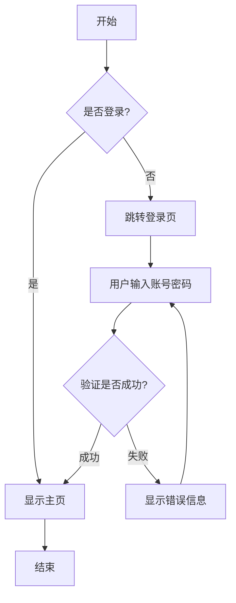
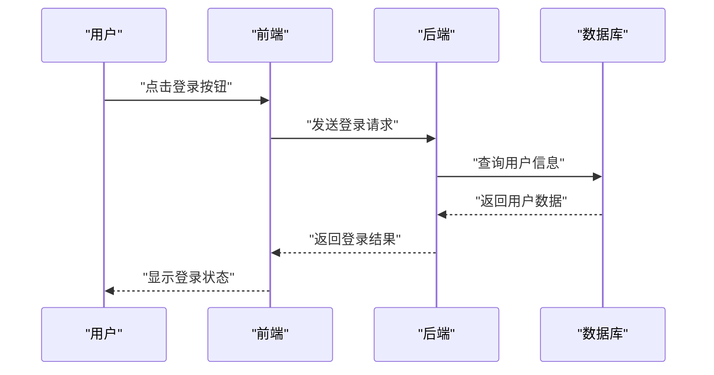
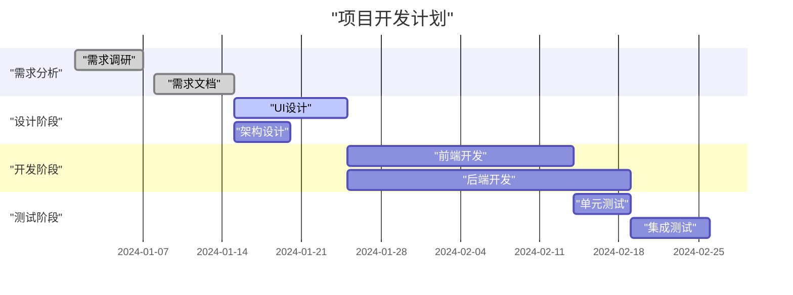
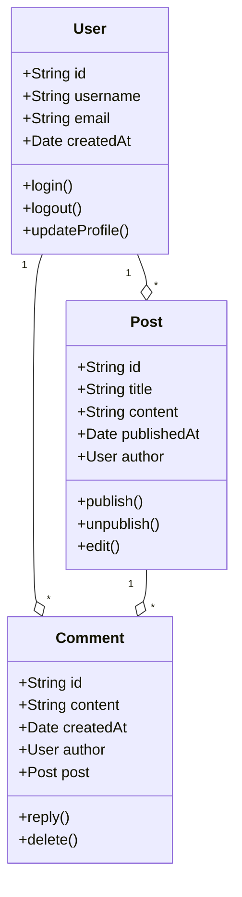
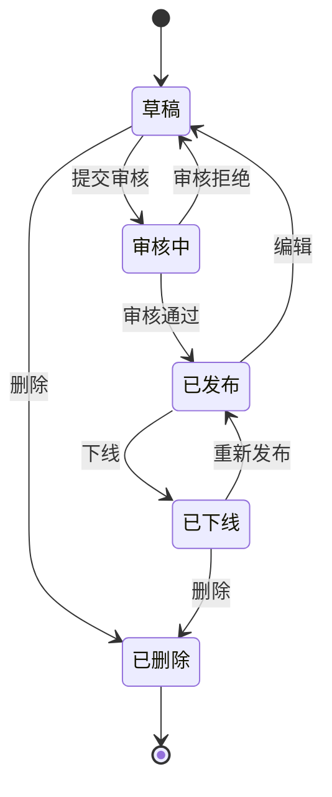

> 明月几时有？把酒问青天。不知天上宫阙，今夕是何年。我欲乘风归去，又恐琼楼玉宇，高处不胜寒。起舞弄清影，何似在人间。
>
> 转朱阁，低绮户，照无眠。不应有恨，何事长向别时圆？人有悲欢离合，月有阴晴圆缺，此事古难全。但愿人长久，千里共婵娟。

---

## Heading2

### Heading3

#### Heading4

##### Heading5

###### Heading6

[MDX](https://mdxjs.com) allows you to use `JSX` in your markdown content. You can **import components**, such as _interactive charts_ or _alerts_, and embed them within your content. This makes writing long-form content with components a blast. 🚀

[MDX](https://mdxjs.com) `MDX` **MDX** _MDX_ ~~MDX~~ ~~_**[`MDX`](https://mdxjs.com)**_~~

https://mdxjs.com/


Here's a simple footnote,[^1] and here's a longer one.[^bignote]

| Command      | Description                                        |
| ------------ | -------------------------------------------------- |
| `git status` | List all _new or modified_ files                   |
| `git diff`   | Show file differences that **haven't been** staged |

```jsx
function Counter() {
  const [count, setCount] = useState(0);

  return (
    <>
      <p>{count}</p>
      <button onClick={() => setCount(count + 1)}>+1</button>
    </>
  );
}
```

- First item
- Second item
- Third item

1. First item
2. Second item
3. Third item

- [x] First item
- [ ] Second item
- [ ] Third item

> [!NOTE]
> Highlights information that users should take into account, even when skimming.

> [!TIP]
> Optional information to help a user be more successful.

> [!IMPORTANT]
> Crucial information necessary for users to succeed.

> [!WARNING]
> Critical content demanding immediate user attention due to potential risks.

> [!CAUTION]
> Negative potential consequences of an action.

[^1]: This is the first footnote.

[^bignote]: Here's one with multiple paragraphs and code.

    Indent paragraphs to include them in the footnote.

    `{ my code }`

    Add as many paragraphs as you like.

## Mermaid 图表示例

### 流程图



### 时序图



### 甘特图



### 类图



### 状态图



## 自定义组件渲染

[GitHub](https://www.github.com)

[YouTube](http://www.youtube.com/)

[TypeScript](https://www.typescriptlang.org/)

[Node](https://www.nodejs.org)

[React](https://reactjs.org)

[Vue](https://vuejs.org)

<linkcard
  title="图片懒加载"
  href="https://github.com/suqingyao/blog-demo/tree/main/packages/lazy-load-image"
  description="图片懒加载是一种网页优化技术，使图片只在用户需要查看时加载，而不是在页面加载时一次性加载所有图片。"
  image="https://w.wallhaven.cc/full/jx/wallhaven-jxd1x5.jpg"
/>

## 列表组件测试

### 无序列表

- 第一项
- 第二项
- 第三项
  - 嵌套项 1
  - 嵌套项 2
    - 深层嵌套项

### 有序列表

1. 第一步
2. 第二步
3. 第三步
   1. 子步骤 1
   2. 子步骤 2

### 任务列表

- [ ] 未完成任务
- [x] 已完成任务
- [ ] 另一个未完成任务

### 混合列表

1. 有序项目
   - 无序子项
   - 另一个无序子项
2. 另一个有序项目
   1. 有序子项
   2. 另一个有序子项

<darktoggle />

## 测试标题
